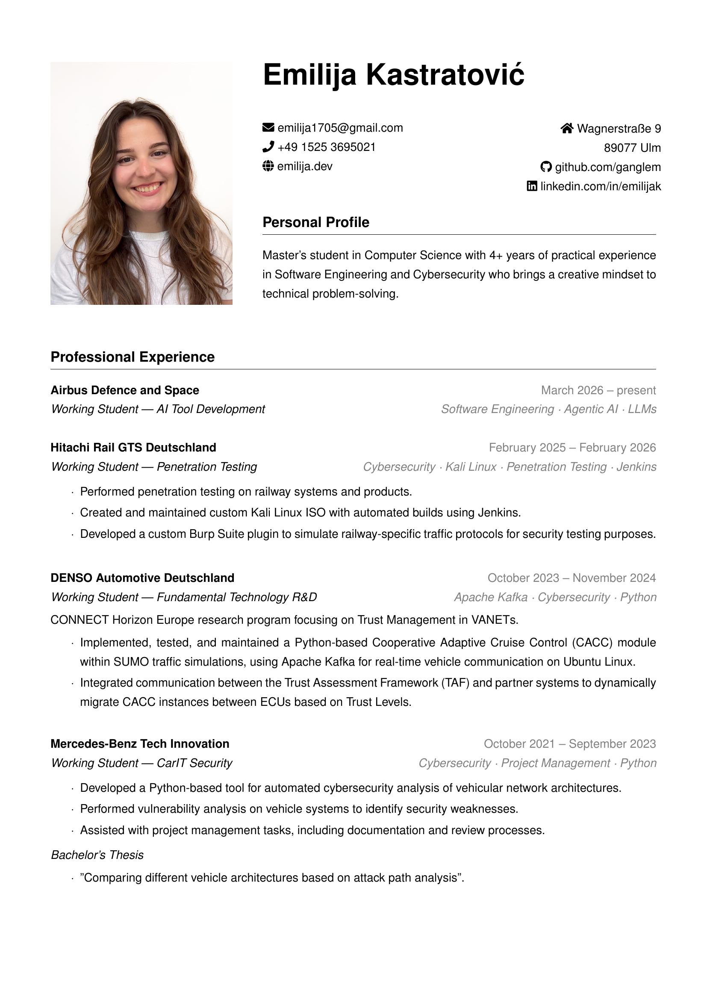
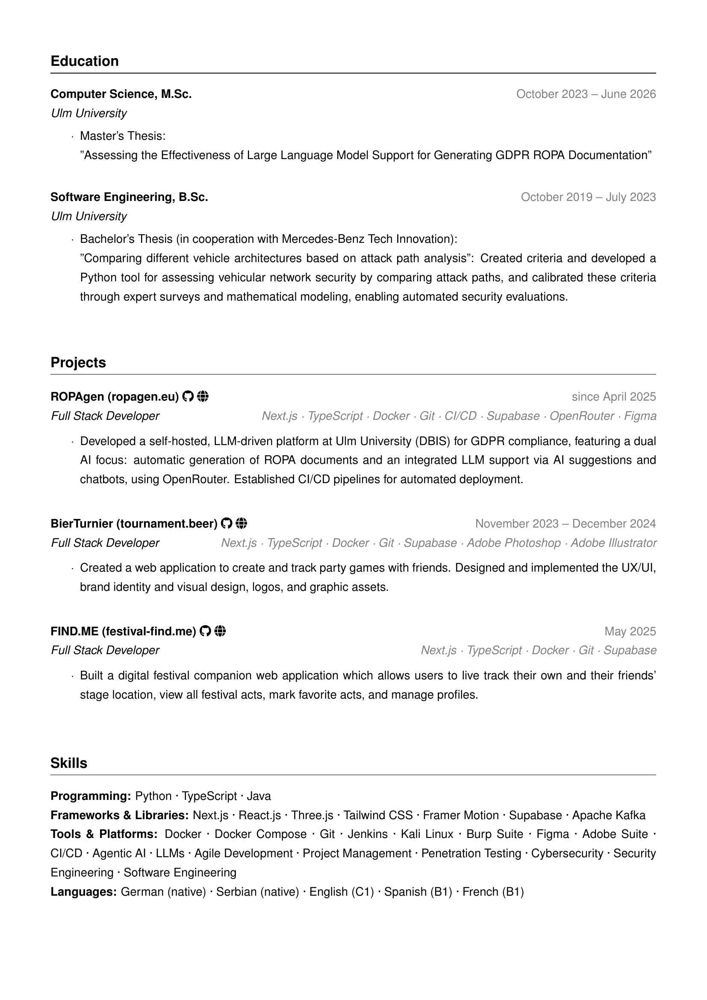

# 🖥️ emilija.dev

Personal portfolio — a VS Code dark IDE aesthetic built with Next.js 15. Live at **[emilija.dev](https://emilija.dev)**.

---

## ✨ Stack

| Layer | Tech |
|---|---|
| Framework | Next.js 15 App Router, TypeScript |
| Styling | Tailwind CSS v3 |
| Deployment | Docker + Traefik + Watchtower |
| CI/CD | GitHub Actions |

---

## 📄 CV

 [**Download PDF**](https://ganglem.github.io/vs-code-portfolio/CV_Emilija_Kastratovic.pdf)

